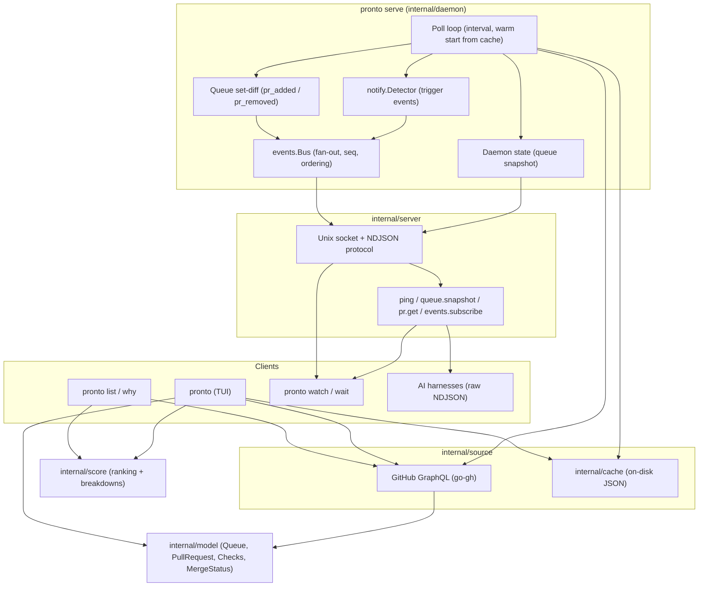

# pronto architecture

pronto is a CLI + TUI for GitHub pull request triage: it fetches your review
queue, scores it, and surfaces what needs attention. A daemon mode exposes the
same state to scripts and AI agents over a local socket.

## Overview

```sh
pronto            → interactive Bubbletea TUI (default invocation)
pronto list/why   → one-shot JSON output
pronto serve      → background daemon: single poll loop + socket API
pronto watch/wait → socket clients for streaming/blocking on events
```

Two consumption modes share one codebase:

- **Pull mode** (CLI/TUI): the process fetches the queue itself.
- **Push mode** (daemon): `pronto serve` owns the only poll loop, detects
  changes, and fans events out to any number of socket subscribers — humans
  watching streams, agents waiting on conditions.

The two modes are independent today: a TUI and a daemon running side by side
each poll GitHub on their own 60s cadence and each write the same
`queue.json` snapshot, last writer winning. See [Known gaps](#known-gaps).

### TUI overview

The interactive Bubbletea interface (`internal/tui`) organizes pull requests
into three views, defaulting to the Focus tab:

1. **Focus (`1`)**: Unified view of user-starred PRs across both review and
   authored queues, partitioned by category dividers in triage priority order
   (`Needs Your Attention`, `Action Required`, `Merge Queue`, `Ready to Merge`,
   `In Review`, `Blocked`, `Drafts`, `Stale`).
2. **Mine (`2`)**: Authored PRs tracked across review and merge lifecycle stages.
3. **Inbox (`3`)**: Incoming review requests and assigned PRs ranked by score.

Key interactions and focus behaviors:

- **Tab switching**: `1`/`2`/`3` jump directly to tabs; `tab` and `shift+tab`
  cycle forward and backward.
- **Focus toggling (`f`) & auto-focus rules**: Toggles focus mode for the selected PR.
  In addition to manual focus, PRs can be automatically focused via `[focus]` config rules
  matching by author, repository, and per-repo keywords, files, or directories. Focused PRs
  display a `★` indicator directly after the selector arrow position and pin to the top of their respective
  category sections in Mine and Inbox views.
- **Persistence**: Focused PR keys (`model.PRKey`) are saved to `focus.json`
  via `cache.Store` on change and reloaded on startup so focus state survives
  session restarts. Closed or removed PRs are automatically pruned from the
  active focus set.
- **Stack folding (`space`/`e`, `E`)**: PRs sharing a stack (branch
  dependency chain) collapse by default into a single table row. All PRs
  display `#<number>` at the start of the title column followed by any stack
  metadata (`[pos/size]` indicator for collapsed stacks and singleton stack
  members in a section) and the PR title, aligning PR numbers and the
  start of PR titles neatly across stacked and standalone items. Collapsed stacks include
  ordered micro-status ribbons for both general review status in the STATUS
  column and CI check states in the CI column (`✓` passing, `✖` failing, `◌`
  running, `○` neutral/none; packed tight at 7–10 PRs, an aggregate badge above 10)
  — and the summed diff roll-up.
  `space` toggles the fold under the cursor: the row becomes a full-width banner
  and children indent beneath it with tree connectors (`├─ #709 [2/7]`). A stack
  renders in the most-urgent category of its members, so draft children stay
  visible in the collapsed roll-up (`score.Rank` keeps stack drafts even though
- **Sorting strategies (`s`, `S`)**: Toggles the display ordering across 4
  strategies: Action status (default category grouping), Repository (grouped
  alphabetically with repo section dividers), Recently Updated (ordered
  by `UpdatedAt` descending), and Priority Score (pure global priority score
  ranking without category dividers). Stacks remain contiguous and the currently
  selected PR stays anchored across sort toggles.

### Architecture



### Event flow

One poll produces at most one event batch, with a `queue_refreshed` outcome
event always last. Trigger events (from the detector) precede structural ones
(from the set-diff); within the structural batch, emit order is currently
unspecified because it comes from map iteration. A merged PR produces **both**
`pr_merged` (detector) and `pr_removed` (it left the open-PR search), so
consumers keying on "PR left the queue" should treat the pair as one
transition:


### Socket protocol

NDJSON (one JSON object per line) over a Unix domain socket at
`~/.config/pronto/pronto.sock` (override: `PRONTO_SOCKET_PATH`).

- Requests: `{"id","method","params"}` → `{"id","result"}` or
  `{"id","error":{"code","message"}}`.
- Methods: `ping`, `queue.snapshot`, `pr.get`, `events.subscribe`.
- `events.subscribe` acknowledges, then pushes events on the same connection.
  Filters (`types`, `repo`, `pr`) AND within one filter, OR across filters.
- No replay: subscribe first, bootstrap with `queue.snapshot`, then apply
  buffered events.
- Contract: `pronto api schema` (embedded from
  `internal/events/schema.json`).

See [agent-skill.md](agent-skill.md) for the consumer-facing guide. Generated
references — [events.md](events.md) (event vocabulary),
[model.md](model.md) (JSON payload shapes), [config.md](config.md)
(configuration keys) — are produced by `tools/gendocs` via `mise run generate`;
edit the source packages, never the generated files.

### Caching

`internal/cache` is a file-backed `Store` under `PRONTO_CACHE_DIR` (default
`os.UserCacheDir()/pronto`). Every write is a temp file + `rename`, so readers
never see a partial file, and every read is miss-tolerant: corrupt, absent, or
schema-mismatched data returns `ok=false`, never an error. Four artifact
kinds, four lifetimes:

| Artifact                                      | File                            | Lifetime                                                                     |
| --------------------------------------------- | ------------------------------- | ---------------------------------------------------------------------------- |
| Viewer identity (login + org-qualified teams) | `identity.json`                 | `identityTTL`, 24h                                                           |
| Per-PR hydrated state                         | `prs/<owner>_<repo>_<num>.json` | reuse gated by `canReuse`; files pruned after `defaultCacheRetention`, 14d   |
| Queue snapshot                                | `queue.json`                    | no TTL in the daemon; the TUI treats it as stale past `SnapshotFreshFor`, 5m |
| Focused PR keys                               | `focus.json`                    | persistent user state (no TTL, loaded on TUI startup)                        |

Fetching is two-phase. **Discovery** runs light GitHub searches (authored,
review-requested, assigned) and dedupes by `(repo, number)`, authored winning.
**Hydration** then fills in the expensive fields — files, checks, timeline,
reviews — in batched aliased queries, bisecting a failing batch down to
singletons so one cost-driven 502 can't lose the whole batch. A secondary rate
limit aborts the fetch instead of bisecting, because the limit is
account-global and retrying while limited risks a ban.

A discovered PR skips hydration entirely when `canReuse` holds: same
`updatedAt`, same `headRefOid`, same merge-queue state, definite merge state,
settled checks, and within the per-PR reuse age (`defaultMaxReuseAge`, 45m,
jittered 0.75–1.25x by an FNV hash of `repo#number` so PRs don't all rehydrate
on the same tick). A PR with no activity past the stale cutoff bypasses the
reuse age — it cannot have changed. Fields that are stable for a given head OID
(`createdAt`, diff sizes, file list) are recovered from cache even on a
hydration miss, so the query only asks for the fresh half.

### PR viewing

`internal/prview` resolves the `pr_view` viewer: `condensed` (default, no
external viewer), `terminal` (`gh pr view`), `vscode` (`open-pull-request-webview`
URI), `web`, or `custom` (user command template). Diff viewing was removed —
the `o` key opens the PR in the browser, whose `/files` tab is the diff view;
`gh`-based diffing and local materialization never matched the real estate
they cost.

### Notifications

`internal/notify` detects what changed (`Detector` → triggers) and delivers
desktop notifications through a `Notifier` interface. The TUI wires the
detector to the notifier built by its factory (`tui.DefaultNotifierFactory`)
from `notifications.*` config; `notify.NewNotifier(notify.Options{Mode, Sound})`
is the single constructor both the TUI and `cmd/pronto` use, so the config
package never has to duplicate backend-selection logic.

Two delivery backends, selected by `notifications.mode` (default `native`):

- **native** — `NativeNotifier` spawns the bundled Swift helper app
  (`ProntoNotify.app`, source in `internal/notify/nativehelper`) which posts
  through the `UserNotifications` framework: Pronto-branded banners, click to
  open the PR (no action buttons), thread grouping per PR, and image
  attachments. Clicks relaunch the helper with empty stdin (responder mode),
  which runs a Dock-less `NSApplication` (UserNotifications only delivers the
  pending response during app launch), opens the notification's link, and
  exits. The detector picks links per trigger: CI failed → first failed
  check's details URL (required checks only when configured; falls back to
  the PR's Checks tab), CI passed → Checks tab, review → the review anchor,
  conflict/merged → the PR.
  The Swift source and Info.plist are embedded in the pronto binary, so any
  install — source checkout, `go install`, or Homebrew — can build the helper
  with `pronto notify setup` (needs only the free Xcode command line tools;
  ad-hoc signed, no Apple Developer account or App Store registration). The
  bundle carries the pronto app icon, generated from the embedded sizes in
  `assets/` at install time, and its `CFBundleVersion` is a content hash of
  the embedded source and icons (`notify.HelperVersion`), so a rebuild with a
  changed icon is a new version and macOS's notification icon cache
  (usernoted, keyed by bundle id + version) is forced to refresh instead of
  serving a stale one. `pronto notify setup` also purges any other
  LaunchServices registration for the same bundle id, so at most one path is
  ever registered; dev builds (`mise run bundle`) use a separate bundle id
  (`notify.DevHelperBundleID`) so they never collide with the installed
  helper. Only `pronto notify setup` (via the helper's `--authorize`) shows
  the one-time macOS permission prompt; the poster never prompts, because
  pronto kills it after the delivery timeout and macOS records a prompt whose
  requester died as denied. Right after the bundle is re-signed, usernoted
  briefly rejects the helper and caches that per process, so both delivery
  (`NativeNotifier`) and setup's authorize step retry by respawning the
  helper. The Go→Swift payload keys are snake_case and mapped via
  `CodingKeys`; a test checks every emitted key is decoded. `NewNotifier`
  wraps native in a `FallbackNotifier` over the terminal backend: when the
  helper is missing (`ErrHelperNotFound`), not yet authorized (helper exit 3,
  `ErrNotAuthorized`), or denied (exit 4, `ErrDenied`), banners go through
  terminal instead, and native is retried every 5 minutes so a mid-session
  `pronto notify setup` takes effect. Other native errors do not fall back (the
  banner may already be posted). `FallbackNotifier.Health` reports the reason
  (or `ErrHelperStale` for an outdated but working helper); the TUI renders it
  as a status-line hint and `pronto notify --test` says when it used the
  fallback. Dev bundles display as "Pronto (dev)" in System Settings.
- **terminal** — `MacNotifier` shells out to `terminal-notifier` with an
  `osascript` fallback. Zero setup; banners are attributed to the helper
  binary rather than pronto.

Both backends sanitize notification text (it originates from GitHub), group
per PR (`pronto-<owner>_<repo>-<number>`), and bound each delivery attempt
with a timeout so one wedged backend cannot stall the queue. Sound is a
macOS system sound name (e.g. `"Glass"`, or `"default"` for the OS alert),
never a file path or `afplay`; it only plays when `notifications.sound` is
true, and each backend passes it through natively (`-sound` for
terminal-notifier, `sound name` for osascript, `UNNotificationSound(named:)`
for native). `notify.SystemSounds()` lists the valid names (macOS's built-in
sounds plus any under `~/Library/Sounds`); `config.Validate` rejects unknown
names at load time.

`pronto notify setup` is the guided, idempotent path to native notifications:
it checks for `swiftc`, builds/installs the helper only if missing or stale
(comparing `notify.HelperVersion()` against the installed bundle's
`CFBundleVersion`), registers it with LaunchServices, requests notification
authorization, and sends a real test banner — each step prints its own
result so a failure is easy to place. `pronto notify` (no subcommand) prints
a passive status report: configured backends, the native helper's
installed/stale/missing state, and (bounded by a short timeout, since it
runs on every invocation) its current authorization status.

### Profiling

`internal/profiling` is the single wiring surface for pprof and the Go 1.27
goroutine leak profiler; nothing else imports `runtime/pprof` or
`net/http/pprof` directly.

**In production:**

- `pronto --debug` (or `pronto serve --debug`):
  - Activates all profiling: live loopback HTTP pprof server (`localhost:6060`, falling back to `localhost:0` if busy), CPU profile on exit (`<cache dir>/cpu.pprof`), heap profile on exit (`<cache dir>/mem.pprof`), and daemon leak checking (`<cache dir>/leaks/`).
  - Sets log level to `DEBUG`.
  - Prints complete info to stderr: log location, live pprof endpoints, how to analyze (`go tool pprof`), profile file paths, and leak dumps.
- `server.pprof_addr` (env `PRONTO_PPROF_ADDR`, default off) serves the
  standard pprof endpoints on a loopback address — including
  `/debug/pprof/goroutineleak`, the GC-based leak profile. The bound address
  is printed to stderr at startup; `localhost:0` picks a free port.
- Every `server.leak_check_interval` (default 1h, `0` disables) the daemon
  runs a leak check. A nonzero count logs a warning and writes
  `goroutineleak-<ts>.pprof` under `<cache dir>/leaks/`, pruning dumps older
  than 7 days. Leaks only ever grow, so an hourly cadence misses nothing.
- `--cpu-profile FILE` / `--mem-profile FILE` write one-shot profiles on
  shutdown for local performance debugging. By default in normal mode,
  the TUI keeps profiling off.

**In tests:** every package's `TestMain` runs `profiling.LeakCheckMain`, two
complementary checks after the suite: a goleak goroutine diff (also catches
IO-blocked goroutines the runtime profiler cannot see) and the runtime
`goroutineleak` profile (no false positives on by-design goroutines).
`profiling.DeferNoLeaks` is available for non-parallel lifecycle tests.

### Key design decisions

- **`source.Source` is the universal test seam** (one method). Tests script
  queue sequences; production uses GraphQL + retry + cache. The TUI, CLI, and
  daemon all fetch through it.
- **One daemon, many consumers.** Only `pronto serve` polls in push mode;
  watchers never hit GitHub directly, so rate limits stay flat.
- **Events reuse the notification vocabulary** (`internal/notify` triggers)
  plus structural events (`pr_added`, `pr_removed`, `queue_refreshed`) so
  daemon consumers and TUI notifications stay consistent.
- **Warm start.** The daemon serves the cached queue snapshot immediately on
  startup and treats it as the change-detection baseline, so a restart reports
  what changed since the cache rather than re-baselining silently. The cached
  snapshot is used as-is regardless of age, and the detector's dedupe set
  starts empty — see [Known gaps](#known-gaps).
- **Per-connection ordering.** One `events.subscribe` call creates one bus
  subscription (OR across its filters): one channel, one writer goroutine, so
  events arrive in emit order with no cross-subscription races. Send a second
  `events.subscribe` on the same connection and you get a second subscription
  and writer, which forfeits that guarantee — one subscribe per connection.
- **Slow consumers drop, emitters never block.** Subscriber channels are
  buffered; a full channel loses events rather than stalling the poll loop.
  Drops are silent, so consumers that care should watch `seq` for gaps.

### Lifecycle

`pronto serve` warm-starts from cache, starts the socket listener, fetches
once, then polls on `server.poll_interval` (`--interval`, default 60s, floor
10s — enforced as an error in `serve`, clamped with a warning for the embedded
TUI daemon). A poll is synchronous within the loop, so a slow fetch delays the
next tick rather than overlapping it.

When GitHub rejects a request because the hourly GraphQL points budget is
exhausted (primary rate limit), the source arms a backoff: until the `resetAt`
observed on the last successful response, or one minute when no reset time is
known. While backed off, `Fetch` fails fast without touching the network, so
an exhausted poller neither burns requests nor risks a secondary-limit ban.

On startup, `prepareSocket` probe-dials the socket path: if something answers,
the daemon refuses to start; if nothing does, a leftover socket file is treated
as stale and removed. That probe is what recovers from an unclean exit — the
process installs no signal handlers, so Ctrl-C or SIGTERM terminates it without
closing the listener, the bus, or saving a final snapshot.

### Known gaps

Tracked in `.agents/local/plans/audit-fix.md` (audit of `internal/daemon`,
`internal/events`, `internal/server`, `internal/source`). The ones that change
how the system behaves in practice:

- **Two pollers, one snapshot file.** The TUI and the daemon each poll GitHub
  and each write `queue.json`. Intended direction: the daemon becomes the sole
  poller and writer, and the TUI consumes `queue.snapshot` plus the event
  stream as a client, falling back to an embedded daemon when no socket
  answers.
- **Shutdown.** No signal handling (above), and `Bus.Close` can deadlock
  against a subscriber's `cancel` because one takes the bus lock inside a
  `sync.Once` the other waits on.
- **A second `pronto serve` unlinks the first one's socket.** It correctly
  refuses to start, but `Server.Close` removes the socket path it never bound.
- **The per-PR reuse age never expires.** The reuse path re-saves each cached
  PR every poll to keep retention pruning from evicting live entries, which
  also advances the timestamp `canReuse` measures the reuse age against. Fields
  that change without bumping `updatedAt` — notably `mergeable` flipping to
  `CONFLICTING` when the base branch moves — can therefore stay stale. The fix
  is to separate "when hydrated" (bounds reuse) from "when last seen" (bounds
  retention).
- **Warm-start bursts.** An old cached snapshot is still used as the detection
  baseline, so a daemon that was down for hours emits every delta at once.
- **Retry covers HTTP status codes only,** not transient network failures, so a
  laptop waking from sleep fails the poll outright.
