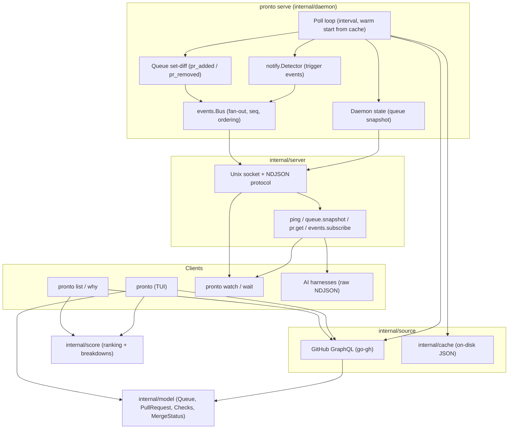
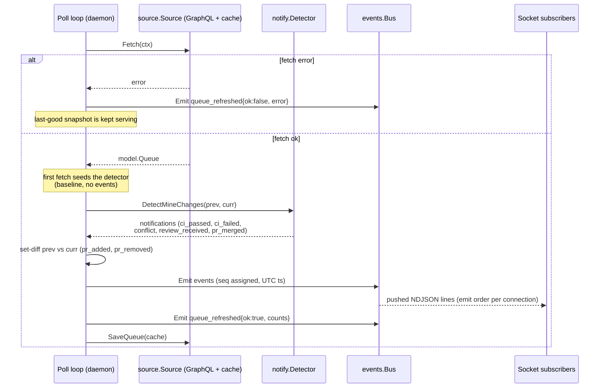

# pronto architecture

pronto is a CLI + TUI for GitHub pull request triage: it fetches your review
queue, scores it, and surfaces what needs attention. A daemon mode exposes the
same state to scripts and AI agents over a local socket.

## Overview

```sh
pronto            → interactive Bubbletea TUI (default invocation)
pronto list/why   → one-shot JSON output
pronto serve      → background daemon: single poll loop + socket API
pronto watch/wait → socket clients for streaming/blocking on events
```

Two consumption modes share one codebase:

- **Pull mode** (CLI/TUI): the process fetches the queue itself.
- **Push mode** (daemon): `pronto serve` owns the only poll loop, detects
  changes, and fans events out to any number of socket subscribers — humans
  watching streams, agents waiting on conditions.

The two modes are independent today: a TUI and a daemon running side by side
each poll GitHub on their own 60s cadence and each write the same
`queue.json` snapshot, last writer winning. See [Known gaps](#known-gaps).

### Architecture



### Event flow

One poll produces at most one event batch, with a `queue_refreshed` outcome
event always last. Trigger events (from the detector) precede structural ones
(from the set-diff); within the structural batch, emit order is currently
unspecified because it comes from map iteration. A merged PR produces **both**
`pr_merged` (detector) and `pr_removed` (it left the open-PR search), so
consumers keying on "PR left the queue" should treat the pair as one
transition:



### Socket protocol

NDJSON (one JSON object per line) over a Unix domain socket at
`~/.config/pronto/pronto.sock` (override: `PRONTO_SOCKET_PATH`).

- Requests: `{"id","method","params"}` → `{"id","result"}` or
  `{"id","error":{"code","message"}}`.
- Methods: `ping`, `queue.snapshot`, `pr.get`, `events.subscribe`.
- `events.subscribe` acknowledges, then pushes events on the same connection.
  Filters (`types`, `repo`, `pr`) AND within one filter, OR across filters.
- No replay: subscribe first, bootstrap with `queue.snapshot`, then apply
  buffered events.
- Contract: `pronto api schema` (embedded from
  `internal/events/schema.json`).

See [agent-skill.md](agent-skill.md) for the consumer-facing guide. Generated
references — [events.md](events.md) (event vocabulary),
[model.md](model.md) (JSON payload shapes), [config.md](config.md)
(configuration keys) — are produced by `tools/gendocs` via `mise run generate`;
edit the source packages, never the generated files.

### Caching

`internal/cache` is a file-backed `Store` under `PRONTO_CACHE_DIR` (default
`os.UserCacheDir()/pronto`). Every write is a temp file + `rename`, so readers
never see a partial file, and every read is miss-tolerant: corrupt, absent, or
schema-mismatched data returns `ok=false`, never an error. Three artifact
kinds, three lifetimes:

| Artifact                                      | File                            | Lifetime                                                                     |
| --------------------------------------------- | ------------------------------- | ---------------------------------------------------------------------------- |
| Viewer identity (login + org-qualified teams) | `identity.json`                 | `identityTTL`, 24h                                                           |
| Per-PR hydrated state                         | `prs/<owner>_<repo>_<num>.json` | reuse gated by `canReuse`; files pruned after `defaultCacheRetention`, 14d   |
| Queue snapshot                                | `queue.json`                    | no TTL in the daemon; the TUI treats it as stale past `SnapshotFreshFor`, 5m |

Fetching is two-phase. **Discovery** runs light GitHub searches (authored,
review-requested, assigned) and dedupes by `(repo, number)`, authored winning.
**Hydration** then fills in the expensive fields — files, checks, timeline,
reviews — in batched aliased queries, bisecting a failing batch down to
singletons so one cost-driven 502 can't lose the whole batch. A secondary rate
limit aborts the fetch instead of bisecting, because the limit is
account-global and retrying while limited risks a ban.

A discovered PR skips hydration entirely when `canReuse` holds: same
`updatedAt`, same `headRefOid`, same merge-queue state, definite merge state,
settled checks, and within the per-PR reuse age (`defaultMaxReuseAge`, 45m,
jittered 0.75–1.25x by an FNV hash of `repo#number` so PRs don't all rehydrate
on the same tick). A PR with no activity past the stale cutoff bypasses the
reuse age — it cannot have changed. Fields that are stable for a given head OID
(`createdAt`, diff sizes, file list) are recovered from cache even on a
hydration miss, so the query only asks for the fresh half.

### Profiling

`internal/profiling` is the single wiring surface for pprof and the Go 1.27
goroutine leak profiler; nothing else imports `runtime/pprof` or
`net/http/pprof` directly.

**In production:**

- `pronto --debug` (or `pronto serve --debug`):
  - Activates all profiling: live loopback HTTP pprof server (`localhost:6060`, falling back to `localhost:0` if busy), CPU profile on exit (`<cache dir>/cpu.pprof`), heap profile on exit (`<cache dir>/mem.pprof`), and daemon leak checking (`<cache dir>/leaks/`).
  - Sets log level to `DEBUG`.
  - Prints complete info to stderr: log location, live pprof endpoints, how to analyze (`go tool pprof`), profile file paths, and leak dumps.
- `server.pprof_addr` (env `PRONTO_PPROF_ADDR`, default off) serves the
  standard pprof endpoints on a loopback address — including
  `/debug/pprof/goroutineleak`, the GC-based leak profile. The bound address
  is printed to stderr at startup; `localhost:0` picks a free port.
- Every `server.leak_check_interval` (default 1h, `0` disables) the daemon
  runs a leak check. A nonzero count logs a warning and writes
  `goroutineleak-<ts>.pprof` under `<cache dir>/leaks/`, pruning dumps older
  than 7 days. Leaks only ever grow, so an hourly cadence misses nothing.
- `--cpu-profile FILE` / `--mem-profile FILE` write one-shot profiles on
  shutdown for local performance debugging. By default in normal mode,
  the TUI keeps profiling off.

**In tests:** every package's `TestMain` runs `profiling.LeakCheckMain`, two
complementary checks after the suite: a goleak goroutine diff (also catches
IO-blocked goroutines the runtime profiler cannot see) and the runtime
`goroutineleak` profile (no false positives on by-design goroutines).
`profiling.DeferNoLeaks` is available for non-parallel lifecycle tests.

### Key design decisions

- **`source.Source` is the universal test seam** (one method). Tests script
  queue sequences; production uses GraphQL + retry + cache. The TUI, CLI, and
  daemon all fetch through it.
- **One daemon, many consumers.** Only `pronto serve` polls in push mode;
  watchers never hit GitHub directly, so rate limits stay flat.
- **Events reuse the notification vocabulary** (`internal/notify` triggers)
  plus structural events (`pr_added`, `pr_removed`, `queue_refreshed`) so
  daemon consumers and TUI notifications stay consistent.
- **Warm start.** The daemon serves the cached queue snapshot immediately on
  startup and treats it as the change-detection baseline, so a restart reports
  what changed since the cache rather than re-baselining silently. The cached
  snapshot is used as-is regardless of age, and the detector's dedupe set
  starts empty — see [Known gaps](#known-gaps).
- **Per-connection ordering.** One `events.subscribe` call creates one bus
  subscription (OR across its filters): one channel, one writer goroutine, so
  events arrive in emit order with no cross-subscription races. Send a second
  `events.subscribe` on the same connection and you get a second subscription
  and writer, which forfeits that guarantee — one subscribe per connection.
- **Slow consumers drop, emitters never block.** Subscriber channels are
  buffered; a full channel loses events rather than stalling the poll loop.
  Drops are silent, so consumers that care should watch `seq` for gaps.

### Lifecycle

`pronto serve` warm-starts from cache, starts the socket listener, fetches
once, then polls on `server.poll_interval` (`--interval`, default 60s). A poll
is synchronous within the loop, so a slow fetch delays the next tick rather
than overlapping it.

On startup, `prepareSocket` probe-dials the socket path: if something answers,
the daemon refuses to start; if nothing does, a leftover socket file is treated
as stale and removed. That probe is what recovers from an unclean exit — the
process installs no signal handlers, so Ctrl-C or SIGTERM terminates it without
closing the listener, the bus, or saving a final snapshot.

### Known gaps

Tracked in `.agents/local/plans/audit-fix.md` (audit of `internal/daemon`,
`internal/events`, `internal/server`, `internal/source`). The ones that change
how the system behaves in practice:

- **Two pollers, one snapshot file.** The TUI and the daemon each poll GitHub
  and each write `queue.json`. Intended direction: the daemon becomes the sole
  poller and writer, and the TUI consumes `queue.snapshot` plus the event
  stream as a client, falling back to an embedded daemon when no socket
  answers.
- **Shutdown.** No signal handling (above), and `Bus.Close` can deadlock
  against a subscriber's `cancel` because one takes the bus lock inside a
  `sync.Once` the other waits on.
- **A second `pronto serve` unlinks the first one's socket.** It correctly
  refuses to start, but `Server.Close` removes the socket path it never bound.
- **The per-PR reuse age never expires.** The reuse path re-saves each cached
  PR every poll to keep retention pruning from evicting live entries, which
  also advances the timestamp `canReuse` measures the reuse age against. Fields
  that change without bumping `updatedAt` — notably `mergeable` flipping to
  `CONFLICTING` when the base branch moves — can therefore stay stale. The fix
  is to separate "when hydrated" (bounds reuse) from "when last seen" (bounds
  retention).
- **Warm-start bursts.** An old cached snapshot is still used as the detection
  baseline, so a daemon that was down for hours emits every delta at once.
- **Retry covers HTTP status codes only,** not transient network failures, so a
  laptop waking from sleep fails the poll outright.
